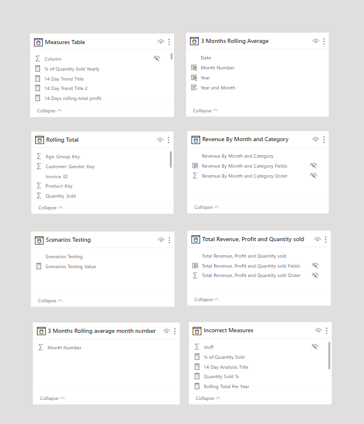
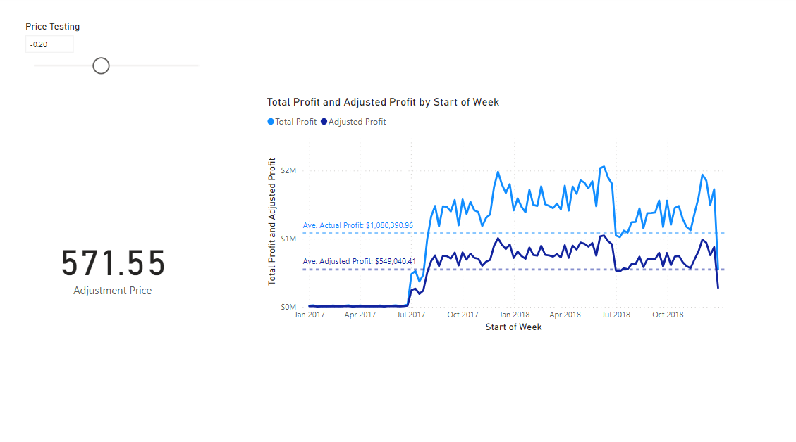

# Sales Performance Insights: A Power BI-Project for Streamlined Data Analysis and Visualization

This report offers business users and stakeholders insights into the company's performance, focusing on sales, revenue, and profit. The metrics are further dissected by different managers, sales country, customers' age groups,  etc. 

Here is a link to my interactive Power BI dashboard: 👉 [here](https://app.powerbi.com/groups/me/reports/27093a3f-0147-4cb4-81cb-da7f80b53189/ReportSection75fb6b750fcd4989e1ba?experience=power-bi&bookmarkGuid=Bookmark61231584d0887d5a16ba)

## Introduction:

Welcome to the dynamic world of data insights! My Power BI project dives deep into the realms of sales and profits, offering a comprehensive analysis across diverse regions, countries, products, and age groups. Uncover the trends, discover correlations, and explore the narrative that unfolds within the visual representations. Let the visualizations guide you through a journey of understanding and decision-making, empowering you with actionable insights for strategic business growth and success.

_**Note**: The dataset utilized and the reports generated do not depict any specific company, institution, or country. It is a simulated dataset employed for the purpose of showcasing Power BI skills._

## Skills/Concept Demonstrated:

The following Power BI features were captured in this projects:
* DAX measures
* Bookmarking
* Filters and page navigation
* Modelling
* Toooltips
* Drillthrough and report interation
* Buttons
* Fields and numeric parameters
* Small multiples
* Binning and grouping
* Row level secutity

## Data Modelling:

- Automatically derived relationships were adjusted to remove and replace unwanted relationships.
- The star schema model was deployed
- There were 2 facts tables and 5 dimension tables.

## Dynamic Data Analysis Expressions (DAX Measures):

1. FOR THE CALCULATED START OF WEEK COLUMN:
  
       Start of Week = 'Calendar'[Date] - WEEKDAY('Calendar'[Date],1)+ 1
   
2. FOR THE 14 DAY ROLLING PROFIT:
  
       14 Days rolling total profit = CALCULATE( SUMX(VALUES('Calendar'[Month Number]),
         [Total Profit]), DATESINPERIOD('Calendar'[Date], MAX('Calendar'[Date]), -14,DAY))

4. FOR THE 14 DAY TITLE:
  
        14 Day Trend Title 2 = VAR SelectedYear = SELECTEDVALUE('Calendar'[Year], "All Year")
       VAR SelectedCategory = SELECTEDVALUE('7 DSP_Products Table'[ProductCategories], "All categories")
       VAR SelectedCountry = SELECTEDVALUE('4 DSP - Regions'[Country], " All Countries")
       RETURN CONCATENATE(SelectedYear, " Weekly Revenue and 14-Days Profit for ") & CONCATENATE(SelectedCategory, " in ") & SelectedCountry

6. FOR MANAGERS SUMMARY:
  
       Managers Summary = SELECTEDVALUE('4  DSP - Regions'[TerritoryManager], "Manager") & "'s Summary"

7. FOR MONTH ON MONTH REVENUE:

            MoM Revenue Growth = 
        DIVIDE([Total Revenue 2]-[Previous Month Revenue],
        [Previous Month Revenue], "N/A"
        )

8. FOR YEAR ON YEAR REVENUE:

       YoY Revenue Growth =
       DIVIDE([Total Revenue 2]-[Previous Year Revenue],
       [Previous Year Revenue], "N/A"
       )

9. FOR TOP PRODUCT BY PROFITS:

        Top Product By Profit Title = "Top Product By Profit - " & FORMAT([Total Profit], "$0,0")

10. FOR MONTHLY REVENUE TITLE:

           Monthly Total Revenue Title = 
        CONCATENATE("Monthly Total Revenue - " , FORMAT([Total Revenue 2], "$0,00"))

11. FOR TOP PRODUCT BY ORDERS:

        Top Product by Orders = "Top Product by Orders - " & [Total Orders]

## Problem Statement 1:

As an expert Data Analyst, your company has tasked you to create the measures below that can used in a table to provide Senior Management a quick insight into the monthly and yearly number of products in stock in comparison to number of products sold. The Manangement is planning to revamp their products supply chain but needs to determine the impact on products inventory.

Measures Required:
1. Quantity sold.
2. Quantity sold rolling total.
3. Total Quantity Sold Per Year
4. Percentage of Quantity Sold Yearly (e.g., 550/7937 = 6.93%)
5. 3-Months Rolling Average (e.g., for 2015 March, (550+518+596)/3 = 554.67)
6. Stock Quantity
7. Stock Quantity Rolling Total
8. Stock 3-Months Rolling Average (e.g., For 2014 October, (149+234+384)/3 = 255.67)

Visualization:
* Using a table, I made a visual representation of the data and information requested as ahwon in the table below;

## Problem Statement 2:

A Power user approached you that they are having issues with their calculations as shown above, and they need you to tell them what is causing the problem. The issue is that the values of each product in the table above for both Total Revenue 1 and 2 measures are the same, but the total values are different. Here are the questions they have:
a. Which of the measures is correct and why?
b. What is the problem with the wrong measure?

Correct measures:

    Total Revenue 2 = SUMX('1  DSP - Sales',
    '1  DSP - Sales'[Quantity_Sold]*RELATED('7  DSP_Products Table'[ProductPrice])
    )

Incorrect measures:

    Total Revenue 1 = {[Quantity Sold]} * [Total Product Price]

Answering the question:

The two measures calculate the total revenue differently:

* Total Revenue 1:

Multiplies the value of [Quantity Sold] measure by the value of [Total Product Price] measure.

* Total Revenue 2:

This is the correct measure for this analysis. It Uses the SUMX function to iterate over each row in the 'Sales table'.
Multiplies the 'Quantity_Sold' from the current row by the related 'ProductPrice' from the 'DSP_Products Table' and sums up the calculated values for each row.

In essence, the first measure relies on pre-existing measures or columns and performs a simple multiplication. The second measure explicitly defines the calculation logic within the measure, considering related tables and using the SUMX function. The choice between them depends on the data model structure and the specific requirements of the analysis.

Visualization:
* Using a table, I visualized both measures and categorized them by product names. The difference can easily be seen in the totals displayed for each of the revenues.

## Problem Statement 3:

You have been recently hired as a Technical Business Intelligence Analyst by DSP Company. The company’s senior management needs some measures to make informed decision on how to grow their revenues, make larger profits and increase customer retention rate.
Your assignment is to employ the complete Microsoft Power BI tools to design, develop and deploy an intuitive and automated dashboard for this Team based on the wireframe provided by the Business Analyst. You have been provided eight datasets containing information about sales, products, customers, and store locations. The csv files are sales, region, gender, products, products_categories, products_subcategrories, age_group, and returns. The objectives of this exercise are to prepare the data, model the data, visualize & analyze the data.

Steps taken:

* I created the dashboard below using several features.
* Cards were used to display the total revenue, total profit, mom revenue, yoy revenue, and total returns.
* I used clustered column charts, maps, tables, and several DAX measures to create and viisualize insights in a dynamic way.
* The visualization can be interacted with via the project link provided at the begining of this project on the page titled "Rebuilding the visualization".

Visualization:

## Problem Statement 4:
Your Manager asked you to create a dashbboard for the company weekly revenue and 14-day profit trend analysis. This dashboard will help the management to know the trajectory of the company financially. Note that the Line chart visual is dynamic with all the filters shown in the wireframe.

Steps Taken:

* Created a calculated column to add start of week (Sunday as the start day) to my calendar.
*  Created a measure for the 14-Day Total Profit.
* Created another measure for the title that is dynamic in nature when certain selections are made.
* The visualization can be interacted with via the project link provided at the begining of this project on the page titled "Visualization classwork".

Visualization:

## More Visualizations:

## Dashboard to show weekly orders by differnt age groups

## Column charts visualizing profit category using the binning and grouping functionalities

## Showing tables created by active and inactive relationships

* I wanted the transction and stock quantities together in one table.
* The only way to achieve this was to create a data model having active and inactive relationships

## Visualizing data using date clusters

## Visualizing data using decomposition tree

## Visualizing the concept of small multiples

## Visualizing the concept of field parameters

## Visualizing the concept of numeric parameters

## Visualizing the concept of 

## CONCLUSION:

- This project aimed to showcase my understanding of and proficiency in Powerbi.
- So many insights can be deduuced from the different visualizations shown.
- The most challenging part of this project was writing the correct data analysis expressions to make the visualization of certain key business questions dynamic.
- I feel confident that I can deploy powerBI to extract miningful insights from any provided data.

  THANK YOU FOR READING! 😄

